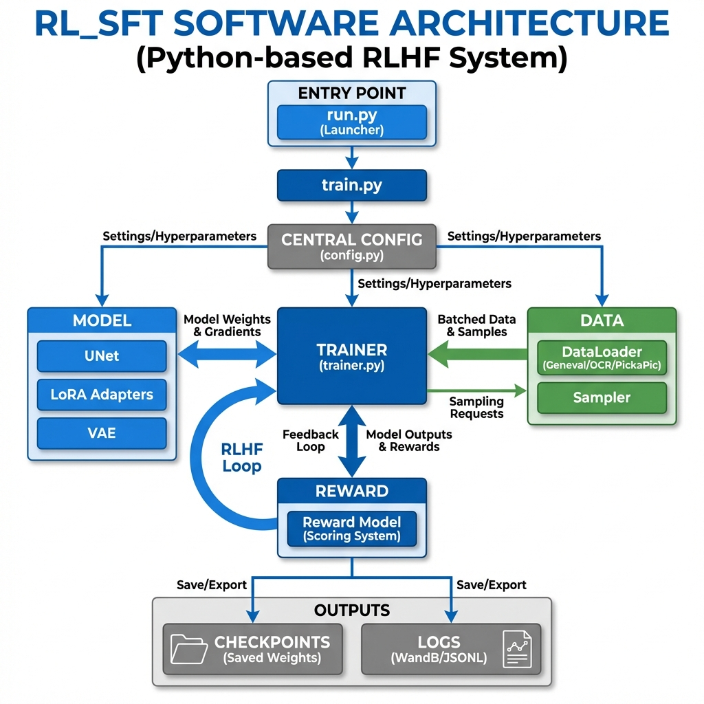
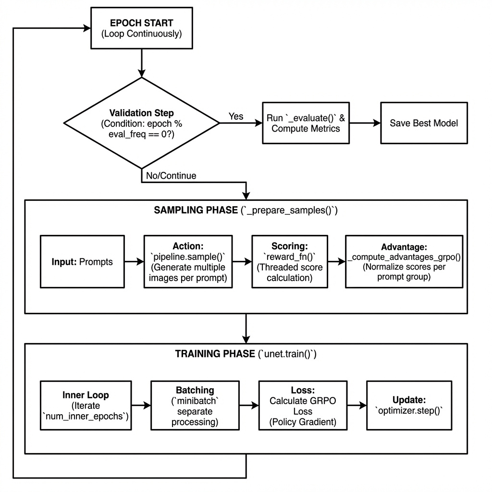
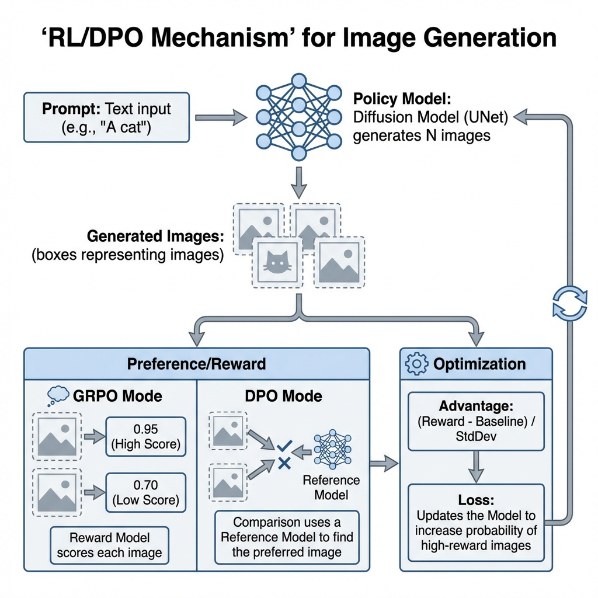

# rl_sft: Advanced Stable Diffusion Training Framework


**rl_sft** is a high-performance, modular training framework for **Stable Diffusion (SD1.4/1.5)**. It unifies state-of-the-art alignment techniques, allowing researchers and developers to fine-tune generative models using:

-   🎯 **Supervised Fine-Tuning (SFT)**: High-fidelity training with ground-truth data.
-   ⚖️ **Group Relative Policy Optimization (GRPO)**: Online reinforcement learning with group-based advantage normalization.
-   👍 **Direct Preference Optimization (DPO)**: Offline alignment using preference data (supports `diffusion-dpo`, `sdpo`, `kto`).

---

## 🌟 Key Highlights

| Core Capability | Description |
| :--- | :--- |
| **Unified Codebase** | Seamlessly switch between SFT, GRPO, and DPO modes via config. |
| **optimized Scale** | Built on `accelerate` with **bf16** mixed precision, **8-bit Adam**, and **Gradient Checkpointing**. |
| **Flexible Rewards** | Plug-and-play reward system (Geneval, PickaPic) for diverse RL objectives. |
| **Advanced DPO** | Includes **Curriculum Learning** and **Multi-Method Comparison** for robust alignment research. |

---

## 🏗️ System Architecture

The framework is built around a centralized `Config` system that drives a modular `Trainer`. This ensures consistency across different training modes while allowing for granular customization.



### Key Components
-   **Trainer**: The core orchestration engine handling the training loop, gradient accumulation, and model updates.
-   **Reward System**: Plug-and-play reward evaluation (e.g., Geneval, PickaPic scoring).
-   **Data Engine**: specialized DataLoaders for diverse formats (WebDataset, Parquet) with automatic aspect ratio bucketing for SFT.

---

## 🚀 Features

-   **Multi-Mode Training**:
    -   **SFT**: Standard fine-tuning with Ground Truth images.
    -   **GRPO**: Online RL with group-based normalization and advantage computation.
    -   **DPO**: Offline preference optimization supporting multiple variants (`diffusion-dpo`, `sdpo`, `kto`).
-   **Performance Optimization**:
    -   Mixed Precision (`bf16`/`fp16`)
    -   8-bit Adam optimizer support
    -   Gradient Checkpointing
    -   LoRA (Low-Rank Adaptation) integration
-   **Advanced DPO Capabilities**:
    -   **Multi-Method Comparison**: Train multiple DPO variants simultaneously on different GPUs.
    -   **Curriculum Learning**: Progressively increase difficulty based on sample scores.
-   **Logging & Tracking**:
    -   Native **WandB** integration.
    -   Local JSONL metrics logging.
    -   Automatic checkpointing with best-model retention.

---

## 🛠️ Installation

Ensure you have **Python 3.10+** and a CUDA-capable GPU.

```bash
# Clone the repository
git clone https://github.com/your-username/rl_sft.git
cd rl_sft

# Install dependencies
pip install torch diffusers accelerate transformers webdataset bitsandbytes wandb
```

---

## ⚡ Quick Start

The entry point for all training tasks is `run.py`. Configuration is handled via JSON files in `configs/`.

### 1. Group Relative Policy Optimization (GRPO)
GRPO uses online sampling and computes advantages relative to a group of generations for the same prompt.

```bash
# Run GRPO with Geneval2 reward on 2 GPUs
python run.py --config configs/grpo_geneval.json --gpus 0,1
```



### 2. Direct Preference Optimization (DPO)
DPO aligns the model using offline preference pairs (Winner vs. Loser). Supported methods include `diffusion-dpo`, `sdpo`, and `kto`.

```bash
# Run DPO using PickaPic dataset
python run.py --config configs/dpo_pickapic.json
```



### 3. Supervised Fine-Tuning (SFT)
Standard training using image-caption pairs with Aspect Ratio Bucketing to preserve image details.

```bash
# Run SFT on Spright dataset
python run.py --config configs/sft_spright.json
```

---

## ⚙️ Configuration & Usage

### CLI Overrides
You can override any configuration parameter from the command line using the `--set` argument or dedicated flags.

```bash
# Example: Change learning rate and enable WandB
python run.py --config configs/dpo_pickapic.json \
    --set training.learning_rate=1e-6 \
    --set logging.use_wandb=true
```

### Key Configuration Parameters (`config.py`)

| Section | Parameter | Description |
| :--- | :--- | :--- |
| **DPO** | `dpo.beta_dpo` | KL penalty strength (default: 5000.0) |
| **DPO** | `dpo.train_method` | training loss: `diffusion-dpo`, `sdpo`, `kto`, etc. |
| **GRPO** | `sampling.num_image_per_prompt` | Number of generations per prompt for group normalization (default: 4) |
| **SFT** | `dataset.root` | Path to the dataset root directory |
| **Run** | `logging.use_wandb` | Enable Weights & Biases logging (True/False) |

---

## 📂 Project Structure

```text
rl_sft/
├── configs/               # JSON Configuration files
├── docs/
│   └── assets/            # Project diagrams and assets
├── src/
│   └── rl_sft/
│       ├── config.py      # Centralized configuration dataclasses
│       ├── train.py       # Training entry point
│       ├── trainer.py     # Main training loops (SFT, DPO, GRPO)
│       ├── model.py       # Model definitions (UNet, VAE, LoRA)
│       └── rewards/       # Reward models for RL
├── run.py                 # Main launcher script
└── requirements.txt       # Python dependencies
```

---

## 📊 Outputs

Training artifacts are saved to `logs/<run_name>/`:
-   **`checkpoints/`**: Saved model weights (Best/Final/Epoch).
-   **`metrics.jsonl`**: Detailed step-by-step metrics.
-   **`config.json`**: Resolved configuration for reproducibility.
-   **`eval_images/`**: (If enabled) Sample images generated during validation.

---

## 🤝 Contributing

Contributions are welcome! Please ensure your code follows the project's style guidelines (Black) and includes appropriate tests.

## 📄 License

This project is licensed under the MIT License.
